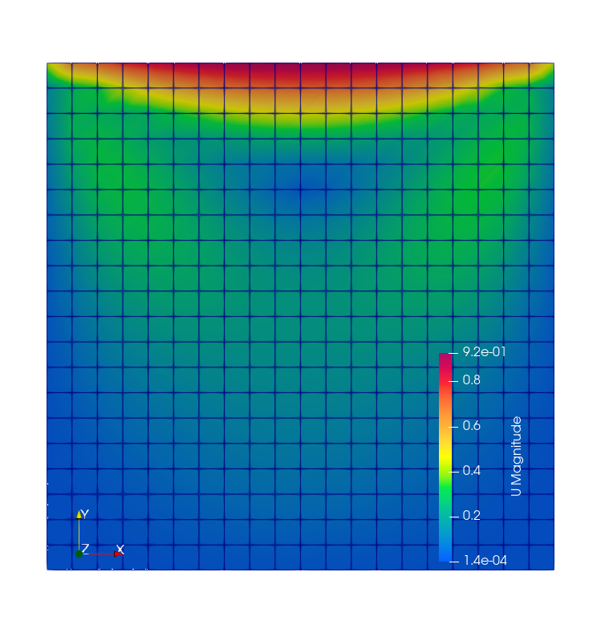
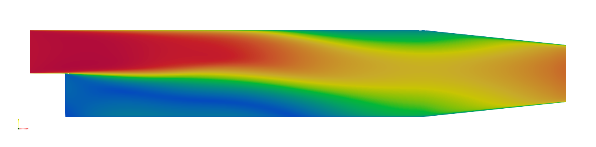

## NebulaSEM

NebulaSEM is an experimental finite volume (FV) and discontinous galerkin spectral element (dGSEM) code 
for solving partial differential equations (PDEs) of fluid dynamics. It comes with solvers for compressible
and incompressible flow, and also provides infrastructure for writing PDE solvers easily with support 
for adaptive mesh refinement (AMR). The primary focus of the software is research in a high-order 
non-hydrostatic dynamical core for atmospheric simulations. Several examples are provided to demonstrate this
capability.

### Build

To build and install NebulaSEM

    mkdir build && cd build
    cmake -DCMAKE_BUILD_TYPE=release -DCMAKE_INSTALL_PREFIX=.. ..
    make && make install

This will install tools for pre-processing, solution and post-processing.
The tool 'mesh' generates the grid, 'prepare' does various pre- and post-processing,
and several other binaries for solving PDEs e.g. euler, convection etc

### Requirements
- [METIS](http://glaros.dtc.umn.edu/gkhome/metis/metis/overview)

### Testing

A testing script `test.sh` is provided. By default it runs the lid-driven test case
under `examples/cavity`, but you can modify the script to run any test case.
To run the test case execute is specifying the number of processors if >1 or a 
different test case.

    Usage: ./test.sh [options]
    
       -n,--np       Number of processors to use.
       -c,--case     Path to grid file name that is under a test case directory.
       -b,--bin-path Path to binaries: mesh, prepare and solvers.
       -s,--steps    Number of time steps, which overwrites the one in control file.
       -h,--help     Display this help message.

#### Lid-driven cavity flow

This test case uses the Pressure Implicit Splitting of Operators (PISO) solver for incompressible
flow at low Reynolds number i.e. no turbulence.

    $ ./test.sh -n 1 -c examples/cavity/cavity
    $ ./test.sh

This will generate a `run1` directory in which you can find the results including VTK
files needed for visualization by paraview.

Here are images of the decompostion using METIS with 12 mpi ranks, and the magnitude of
velocity plots.

  
  

#### Pitz-Daily test case

A second, more beautiful images for the Pitz and Daily test case using LES is shown below.
You can see the formation of eddies at the backward facing step and later convection towards
the outlet.

  

The same test case simulated with the ke turbulence model is shown below. It is a Reynolds-average
turbulence scheme so only mean state is displayed.

  

#### Rising thermal bubble

This is a popular test case for numerical weather prediction models that solve the Euler equations
using explicit time-stepping unlike other CFD applications that often use implicit solvers.
Moreover this test cases uses Discontinous Galerkin method (spectral-element version) on hexahedral
grids. Thanks to my postdoc supervisor Francis X. Giraldo, from whom I learned this stuff!

A thermal bubble (of gaussian distribution) rises up due to bouyancy, while deforming on the way,
and collides with the top boundary.

  

